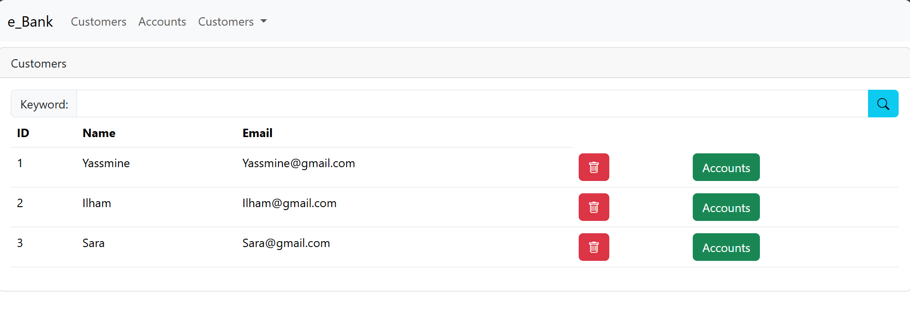
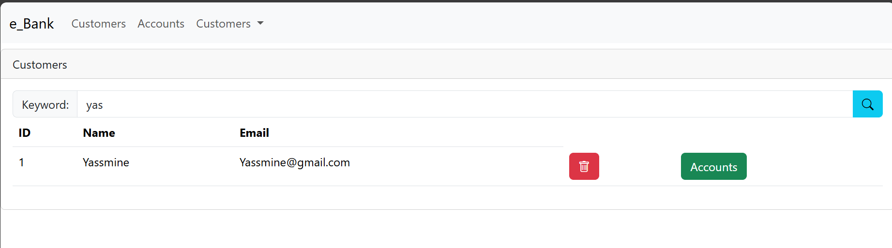
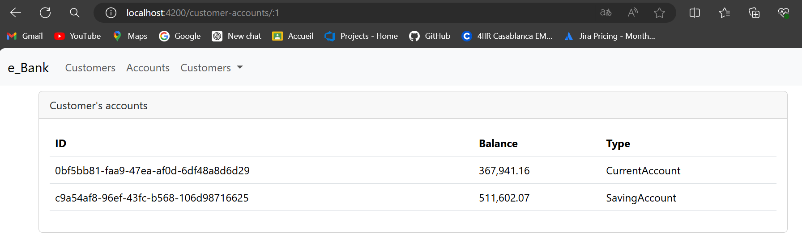
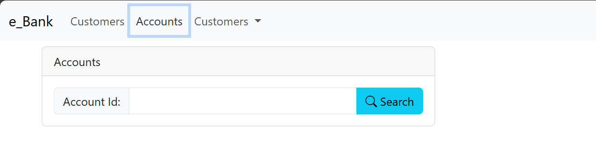
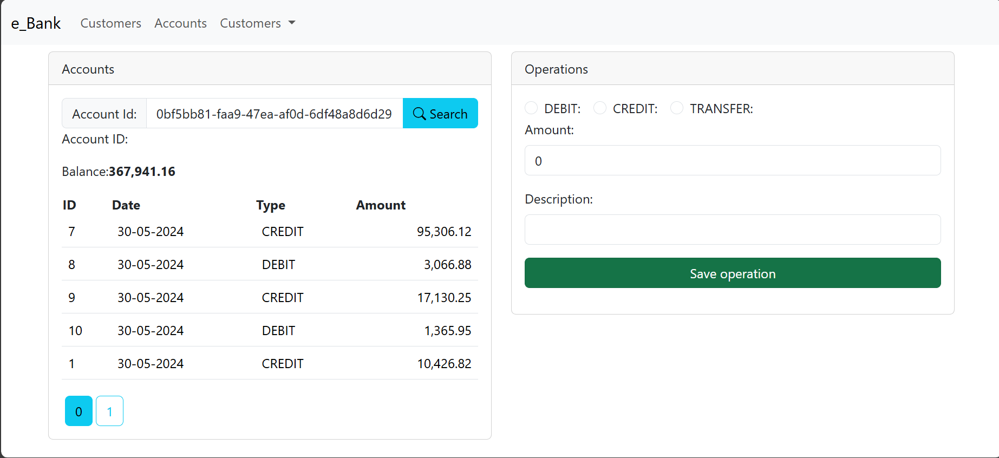
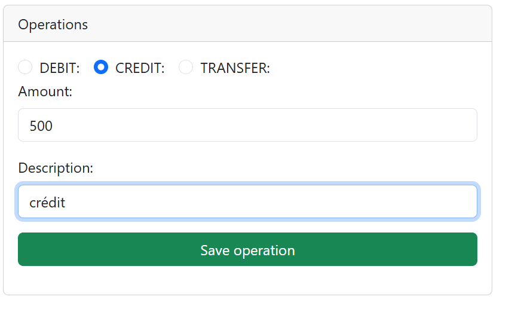
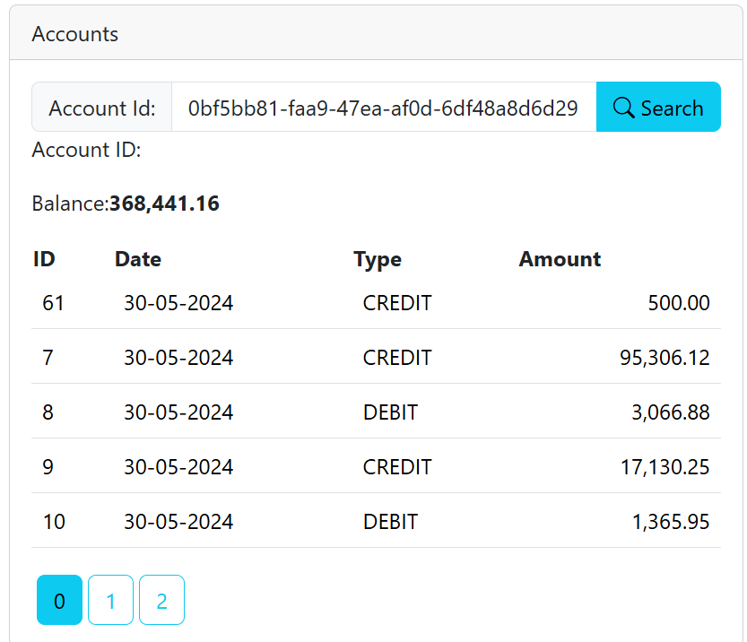

<h1>Compte rendu du projet e_banking (Frontend)</h1>

Aprés avoir réalisé le backend je me suis attaquée au frontend 
en utilisant Angular 

<h2>Components</h2>

J'ai créé cinq components: 

<ul>
<li>Accounts: ce component affiche un formulaire où l'utilisateur doit saisir l'id du compte
puis affiche le détail du compte et la possibilté d'effectuer differentes operations</li>
<li>Customers: pour afficher les differents clients de la banque avec la possibilité de rechercher un clinet et de supprimer
 ou de consulter les comptes de chaque client</li>
<li>customer-account: afficher les compte d'un client</li>
<li>navbar </li>
<li>New-customer: pour afficher le formulaire de l'ajout d'un client</li>
</ul>

<h2>Services</h2>

J'ai créé deux services : 

<ul>
<li>account: ce service contient les differentes fonctionnalités et operations 
que l'on peut effectuer sur un compte débit, crédit, transfer et consultation</li>
<li>customer: ce service contient les differentes fonctionnalités et operations 
que l'on peut effectuer sur un customer </li>
</ul>

puis j'ai fais l'injection des dependances dans les components 

<h2>Models</h2>

J'ai créé deux models : 

<ul>
<li>customer</li>
<li>accounts</li>
</ul>

que j'ai utilisé pour afficher les données

<h2>Customers</h2>

<h3>Rechercher un customer à partir d'un mot clé:</h3>

<h3>Consulter les comptes d'un customer</h3>

<h2>Accounts</h2>

<h3>Details d'un compte recherché</h3>

<h3>Opération de crédit </h3>

